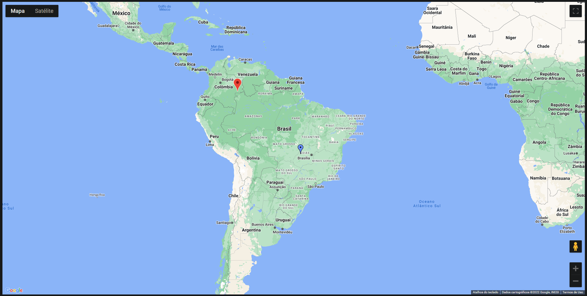
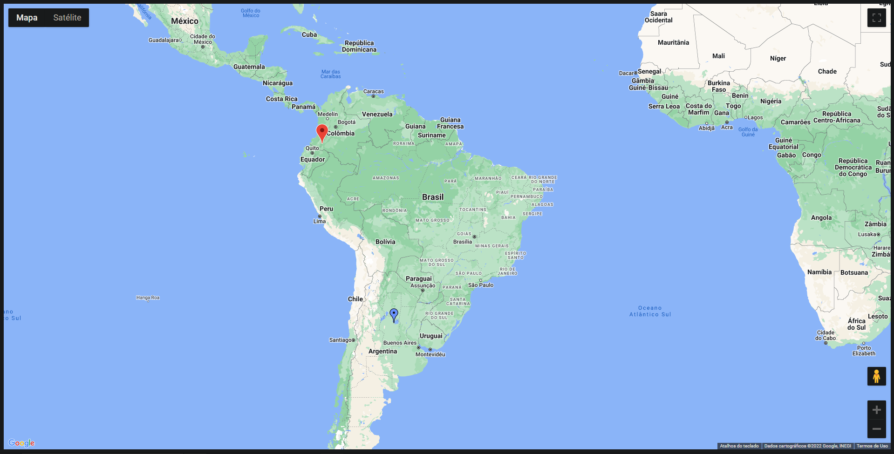

### TSMaps

Projeto criado em Typescript com a finalidade de aprender a linguagem.
Este aplicativo irá criar um mapa utilizando a API do Google Maps, gerar um usuário e uma empresa randomicamente utilizando Faker-js e definir a localização de ambos no mapa.

### Getting Started

```sh
git clone https://github.com/LukasxzB/TSMaps
cd TSMaps
npm install

# Agora você poderá inicializar o aplicativo
parcel .\index.html
```

### Screenshots




